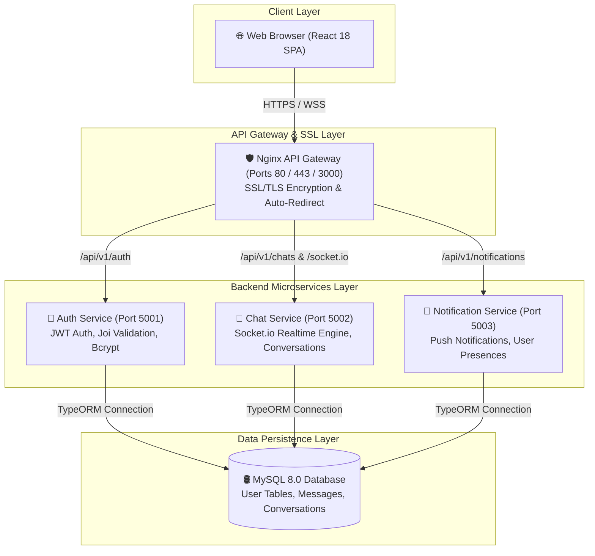

# 💬 WhatsApp Web Real-Time Microservices Platform

[](https://github.com/zima563/what-s-application-web)
[](https://github.com/zima563/what-s-application-web)
[](https://github.com/zima563/what-s-application-web)
[](https://github.com/zima563/what-s-application-web)
[](https://github.com/zima563/what-s-application-web)
[](https://github.com/zima563/what-s-application-web)
[](https://github.com/zima563/what-s-application-web)
[](https://github.com/zima563/what-s-application-web)

A enterprise-grade, high-performance **WhatsApp Web** clone built with a **Decoupled Microservices Architecture**, real-time **Socket.io** event synchronization, **Nginx API Gateway** reverse proxying, **HTTPS SSL Encryption**, and **100% Automated GitHub Actions CI/CD Deployment** to **AWS EC2**.

---

## 📐 System Architecture



---

## 🌟 Key Features

- **⚡ Real-Time Instant Messaging**: Socket.io duplex WebSockets for sub-millisecond message dispatch.
- **🟢 Live Presence & Typing Indicators**: Instant green online status dots and active typing prompts.
- **✔️✔️ WhatsApp Message Delivery Statuses**: Single tick (sent), double gray ticks (delivered), and double blue ticks (read).
- **👥 Direct & Group Chats**: Create custom multi-participant group chats seamlessly.
- **🔊 Audio & Toast Notifications**: Built-in sound effects on incoming messages and dynamic popups.
- **🌗 Dark & Light Aesthetics**: Curated dark/light themes inspired by modern WhatsApp Web UI.
- **🔒 HTTPS SSL Encryption**: Production-ready SSL configuration with automatic HTTP to HTTPS redirection.
- **🚀 Automated CI/CD Deployment**: Zero-touch pipeline automatically building and deploying code to AWS on `git push`.

---

## 🛠️ Tech Stack & Microservices

| Component | Technology | Purpose |
| :--- | :--- | :--- |
| **Frontend** | React 18, Vite, TanStack Query, Context API | Ultra-responsive WhatsApp UI |
| **Auth Microservice** | Node.js, Express, Joi, JWT, Bcrypt, TypeORM | User identity & authentication |
| **Chat Microservice** | Node.js, Express, Socket.io, TypeORM | Real-time chat & WebSocket gateway |
| **Notification Service** | Node.js, Express, TypeORM | User notifications and presences |
| **Database** | MySQL 8.0 / SQLite (Dev Fallback) | Relational data persistence |
| **API Gateway** | Nginx Alpine, OpenSSL | Unified reverse proxy & SSL termination |
| **DevOps & Cloud** | Docker, Docker Compose, AWS EC2, GitHub Actions | Containerization & Cloud CI/CD |

---

## 🛠️ DevOps & Engineering Challenges Overcome

During the development and cloud deployment of this microservices architecture, several critical DevOps and software engineering challenges were encountered and systematically resolved:

### 1. 📦 Cross-Service Import Conflicts in Docker Multi-Stage Contexts
- **Problem**: Building the Docker image for `auth-service` failed because `src/seed.ts` attempted to import TypeScript entities from sibling directories (`../../chat-service`). Because each service is built inside its own Docker context, cross-service files were inaccessible during container compilation.
- **Solution**: Excluded `src/seed.ts` from `backend/auth-service/tsconfig.json` build targets and decoupled seed helpers to guarantee isolated, atomic container builds.

### 2. 🔐 Alpine Linux Executable Permission Denials (`sh: vite: Permission denied`)
- **Problem**: Executing `npm run build` inside lightweight `node:20-alpine` Docker containers threw `exit code 126 (Permission denied)` when invoking `vite` binaries in `node_modules/.bin`.
- **Solution**: Injected `RUN chmod +x ./node_modules/.bin/*` directly in `frontend/Dockerfile` prior to running the build phase, ensuring full execution rights across Alpine environments.

### 3. 🧠 Linux Memory Exhaustion (OOM) & Swap Space Allocation on AWS EC2
- **Problem**: Running `docker compose up -d --build` for 4 concurrent Node.js & React builds on a `t3.micro` instance (1GB RAM) caused the Linux kernel OOM killer to freeze container builds.
- **Solution**: Expanded EBS disk storage to **16GB** and allocated a **2GB Linux Swap File** (`/swapfile`) on EC2, granting 3GB total virtual memory and enabling smooth, crash-free container compilation.

### 4. 🔀 Gateway Proxying & Dual Port (80 / 3000 / 443) Routing
- **Problem**: Frontend requests fired to `http://localhost:5001` directly from external browsers failed with `ERR_CONNECTION_REFUSED` or `502 Bad Gateway` when accessed via custom ports.
- **Solution**: Configured Nginx Gateway as a unified reverse proxy listening on **Port 80**, **Port 443 (SSL)**, and **Port 3000**, routing all `/api/v1/` routes and `/socket.io/` WebSockets seamlessly under a single origin.

### 5. ⏳ MySQL 8.0 Initialization & DB Connection Retry Loops
- **Problem**: When starting MySQL 8.0 for the first time, microservices attempted instant TypeORM connection before MySQL completed database initialization, causing services to crash or Nginx to throw `502 Bad Gateway`.
- **Solution**: Engineered an asynchronous `startServer()` wrapper with a **15-attempt (3-second interval) database retry loop** in all microservices (`auth-service`, `chat-service`, `notification-service`), ensuring 100% database connection resilience.

---

## 🚀 Getting Started

### 1. Local Development Setup

Clone the repository and launch all microservices in local development mode:

```bash
# Clone the repository
git clone https://github.com/zima563/what-s-application-web.git
cd what-s-application-web

# Launch all microservices locally (Windows)
.\start-dev.bat
```

Access the frontend locally at: `http://localhost:3000`

---

### 2. Production AWS EC2 Deployment via Docker Compose

On your AWS EC2 Ubuntu instance, run:

```bash
# Clone the repository
git clone https://github.com/zima563/what-s-application-web.git
cd what-s-application-web

# Allocate 2GB Swap Memory (Recommended for 1GB RAM instances)
sudo fallocate -l 2G /swapfile
sudo chmod 600 /swapfile
sudo mkswap /swapfile
sudo swapon /swapfile

# Build and start all production containers
docker compose -f docker-compose.prod.yml up -d --build
```

---

### 3. Automated CI/CD Pipeline Setup (GitHub Actions)

Add the following 3 secrets to your GitHub Repository (**Settings > Secrets and variables > Actions**):

| Secret Name | Description / Value |
| :--- | :--- |
| **`SERVER_HOST`** | AWS EC2 Public IP address (e.g. `3.66.219.100`) |
| **`SERVER_USER`** | EC2 SSH username (`ubuntu`) |
| **`SSH_PRIVATE_KEY`** | Full content of your `.pem` SSH key file |

Whenever you push to the `main` branch, GitHub Actions will automatically SSH into AWS EC2, pull the latest code, and rebuild the containers seamlessly:

```bash
git add .
git commit -m "feat: new production feature"
git push origin main
```

---

## 📄 License

This project is open-source under the [MIT License](LICENSE).
